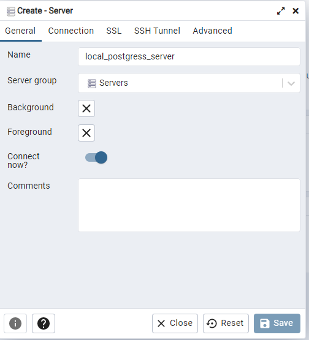
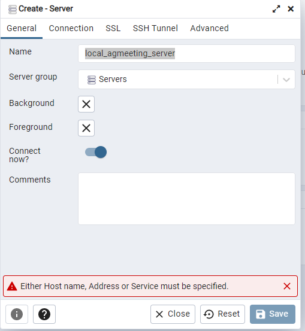
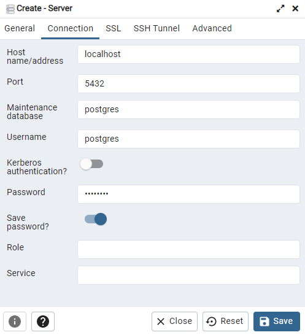
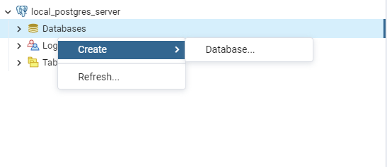
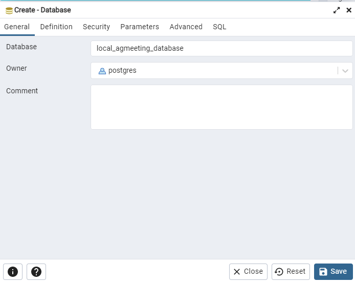
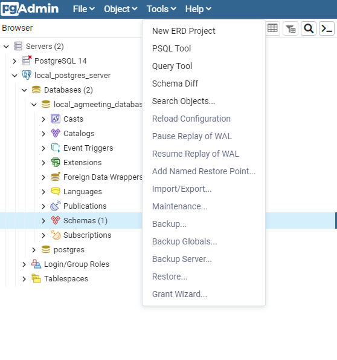
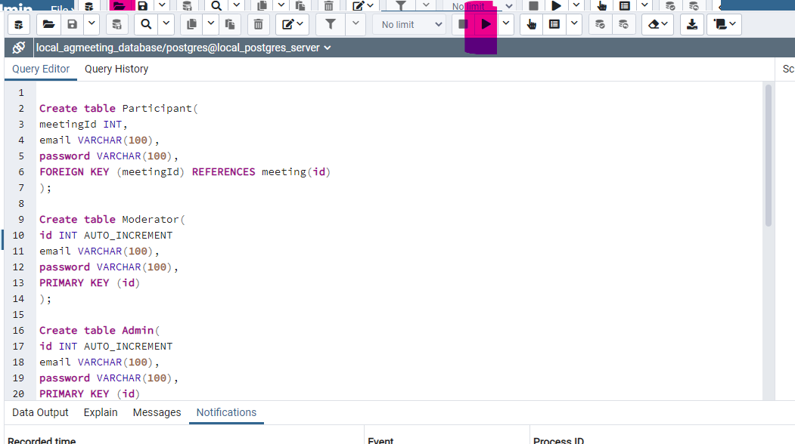
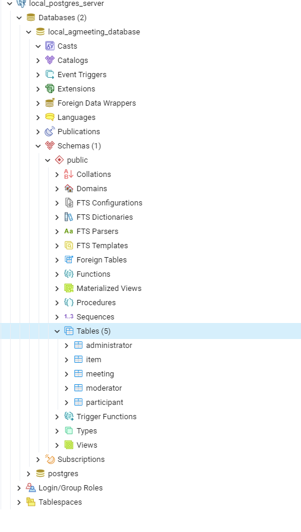

# Resources for database

## For Development we can use pgAdmin and postgress to host locally

download link: https://www.postgresql.org/download/
14.1.1 is the newest version so I downloaded that one. pgadmin is also included in that download link.

unclick finish installation with stackbuilder at the end.

use password as password during installation.

## setup local database

### Step 1

open pgaadmin right click on servers tab and hover over create and click the option "sever..".

### Step 2

Under general write the name as local_postgres_server.

### Step 3

Click on the Connection tab at the top of the window.
fill in the table as follows if not mentioned leave as is:

Host: localhost
password: password
check password box

Then press save.

### Step 4

Now the server will appear under the servers tab on the left
expand the local_postgres_server and right click on database and hover over create and click the "Database..." option.

### Step 5

name the database local_agmeeting_database then press save.

The database is now live

### Step 6

Click on tools on the top toolbar and select Query tool.

### Step 7

click the highlighted option in the image navigate your directorys to find database design.sql and double click it to import it.

### Step 8

Click the highlighted option in the image below. To run sql create table statements.

### Step 9

right click the database name and press refresh.

after this open the schemas option and then open the tables option they should all be there

